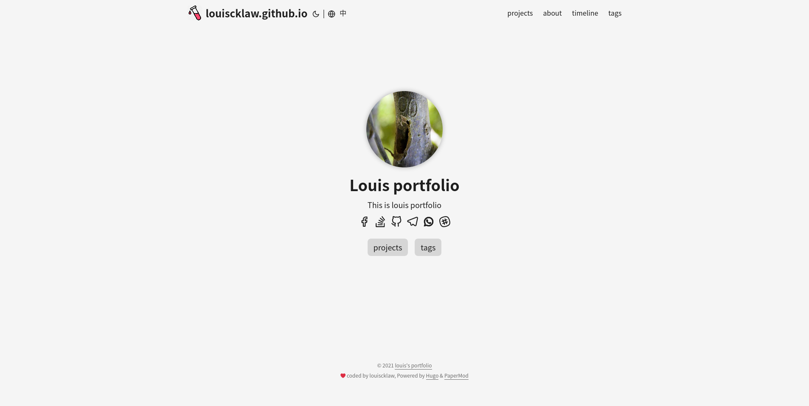

## background information:

This is my portfolio. This website contains my project information.

## build flow:

In general, the build should be process under 
  1. build
  1. test
  1. merge
  1. deploy

## Test ? how to test ?

### visual regression test / viewport

 and visual regression is used to test how page look lik under difference device:

#### for example
| devices ? view port      | screenshot |
| ----------- | ----------- |
| ipad_mini      |        |
| iphone x   |         |
| macbook 13   |         |
 
### page transverse

page transverse test is used to simulate user browse the page/apps under test:

#### for example
| path      | screenshot |
| ----------- | ----------- |
| project      |        |
| project (zh_tw)   |         |

## tools used:

- 
- 

## references / repositories:
- current tryout 
- old tryout 
