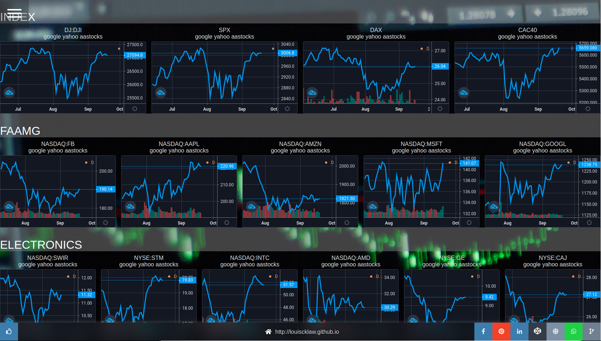

+++
title = "Tradingview Dashboard"
description = "A simple page to monitor stock, while data provided by trading view"
tags = [
    "react",
    "javascript",
]
+++

## Demo:



## References / repositories:


