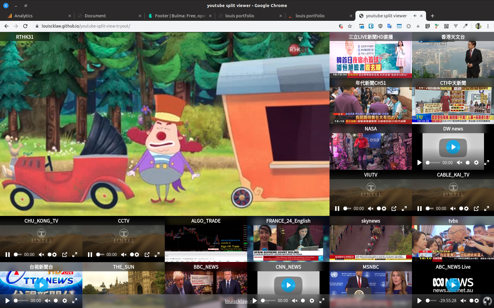

+++
title = "youtube split view tryout"
description = "A brief description of Hugo Shortcodes"
tags = [
    "shortcodes",
    "privacy",
]
+++

## Purpose

this is a youtube/mpv viewer working in browser to let you monitor around 20 channel in same screen.

## <!--more-->

## Demo:



## Status:

Currently revamping with gatsby

## References / repositories:

louiscklaw/youtube-split-view-tryout

## Other youtube solution:

http://afterglowplayer.com/
