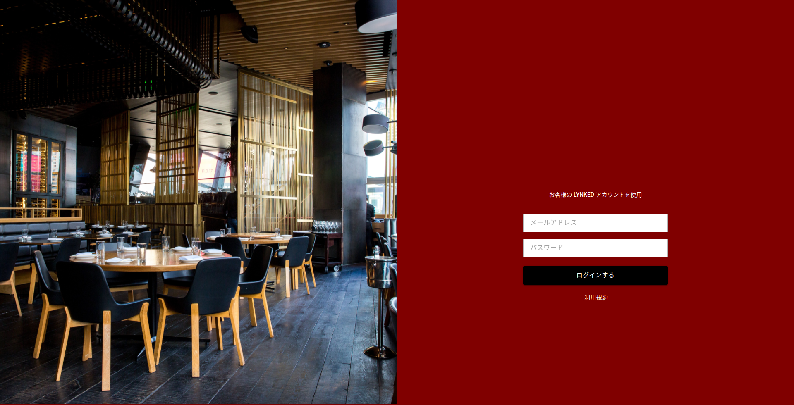

+++
title = "restaurant ordering system"
description = "a simple clone of restaurant ordering system blablabla"
tags = [
    "firebase",
    "react",
    "javascript",
]
+++


graph TD;
    RESTAURANT_STATUS_UNKNOWN-->RESTAURANT_CLOSED;
    RESTAURANT_STATUS_UNKNOWN-->RESTAURANT_OPENED;
    RESTAURANT_OPENED-->CLIENT_LANDING;

    CLIENT_LANDING--CLIENT_REQUEST_TABLE-->CLIENT_WAITING_TABLE;
    CLIENT_WAITING_TABLE--RESTAURANT_ASSIGNED_TABLE-->CLIENT_TABLE_ASSIGNED;

    CLIENT_WAITING_TABLE--restaurant close-->RESTAURANT_STATUS_UNKNOWN;
    CLIENT_BILL_CLEARED-->RESTAURANT_STATUS_UNKNOWN;

    CLIENT_TABLE_ASSIGNED--bill created-->CLIENT_BILL_CLEARED;


## REFERENCES / REPOSITORIES:

N/A
